# LLM-Based AI Agent for Fixing Buggy Python Code

This project implements an **LLM-based agent** capable of **fixing Python code** by iteratively analyzing test failures and improving its outputs.
The agent is implemented using **LangGraph** and evaluated on the **Python subset of [HumanEvalFix](https://huggingface.co/datasets/bigcode/humanevalpack)**.

---

## Overview

The goal of this project is to build and evaluate a **lightweight, reasoning-capable AI agent** that can automatically **debug and repair faulty Python functions** using feedback from test assertions.

I didn't want to use ReAct-style agent, because it would probably struggle with lightweight LLMs. So, I used **reflection from failed test feedback**.

---

## Usage

To evaluate the agent and compute **pass@1** accuracy on HumanEvalFix, run:

```bash
python3 src/main.py <model_name>
```

Where <model_name> is the name of a hugging face model.

Optionally, you can specify:
- Number of reasoning iterations
- Whether to run scripts locally or in docker container (default is in docker)
- Verbosity
- And other arguments

See all options with:
```bash
python3 src/main.py -h
```

Example (run the verbose no-reasoning agent on first 5 samples):

```bash
python3 src/main.py unsloth/Qwen2.5-Coder-0.5B-Instruct -v --i 0 --ts 5
```

## Agent Architecture

The agent consists of **four core LLM nodes**:

| Node | Description                                                                                                              |
|------|--------------------------------------------------------------------------------------------------------------------------|
| **draft** | Produces the initial implementation.                                                                                     |
| **reflect** | Receives the failed assertion and revises the code accordingly.                                                          |
| **repeat** | Visited when the LLM repeats previous code. Invokes LLM with a separate prompt.                                          |
| **syntax** | Visited when the LLM produces invalid Python syntax or incorrect function signature. Invokes LLM with a separate prompt. |

The **iteration node** increases the reasoning step counter, while **guard nodes** stop execution when the maximum iteration limit is reached.

The full LangGraph graph is visualized below:



## Implementation Details

To reduce the size of LLM prompts:
* The reflection prompt only includes the line with the failed assertion, that is extracted from the stderr of the testing process.
* A function is explicitly extracted from LLM output, and signature is verified. Following prompts only include the extracted function, omitting potential extra content of the output.

To encourage exploration over time, the temperature of the model increases with each iteration.

* Iteration 0 (draft node): starts at temperature zero (deterministic output).
* Later iterations: gradually increase temperature for more diverse outputs.

## Benchmarking Results

I evaluated two open-weight instruction-tuned code models:

1) `unsloth/Qwen2.5-Coder-0.5B-Instruct`
2) `deepseek-ai/deepseek-coder-1.3b-instruct`

The **pass@1** metric improves consistently as the number of reasoning iterations increases:


This confirms that **iterative reflection** — even with small models — can significantly improve the agent’s code fixing capability.
